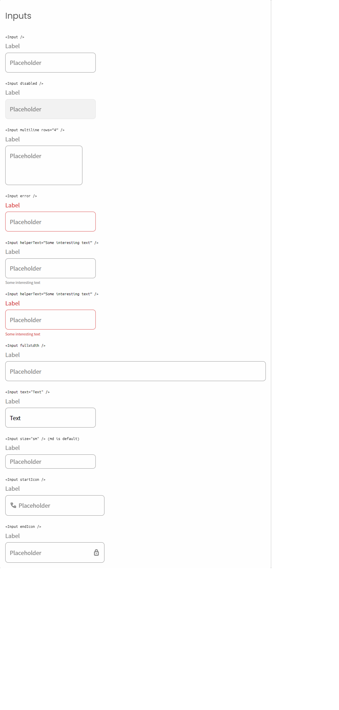

# Tino's reusable input with Vite + React

Solution for a challenge from  <a href="http://devchallenges.io" target="_blank">Devchallenges.io</a>.

[Demo](https://dc-frontend-02.vercel.app/) | 
[Solution](https://github.com/tinoreyna1984/dc-frontend-02) | 
[Challenge](https://devchallenges.io/challenges/TSqutYM4c5WtluM7QzGp)

## Table of Contents

- [Overview](#overview)
- [Built With](#built-with)
- [Features](#features)
- [How to use](#how-to-use)
- [Contact](#contact)
- [Acknowledgements](#acknowledgements)

## Overview



Since I have been working with React and Next.js, I wanted to try a bit more of excercising the concepts of a functional class, reusability and a deep understanding of some logic combinations to achieve this challenge. The screenshot shows the as-is aspects of all custom inputs, so you can check out by clicking or hovering on any of these inputs to see that satisfies the design from the Figma file.

### Built With

- [React](https://reactjs.org/) + [Vite](https://vitejs.dev/)
- [SASS](https://sass-lang.com/): CSS with superpowers

## Features

This application/site was created as a submission to a [DevChallenges](https://devchallenges.io/challenges) challenge. The [challenge](https://devchallenges.io/challenges/TSqutYM4c5WtluM7QzGp) was to build an application to complete the given user stories.

## How To Use

To clone and run this application, you'll need [Git](https://git-scm.com) and [Node.js](https://nodejs.org/en/download/) (which comes with [npm](http://npmjs.com)) installed on your computer. From your command line:

```bash
# Clone this repository
$ git clone https://github.com/tinoreyna1984/dc-frontend-01

# Install dependencies
$ npm i

# Run the app
$ npm run dev
```

## Acknowledgements

- [Steps to replicate a design with only HTML and CSS](https://devchallenges-blogs.web.app/how-to-replicate-design/)
- [Node.js](https://nodejs.org/)
- [Marked - a markdown parser](https://github.com/chjj/marked)
- My teachers.

## Contact

- Website [TinexLab](https://tinexlab.vercel.app/)
- GitHub [@tinoreyna1984](https://github.com/tinoreyna1984)
- Twitter [@tinoreyna1984](https://twitter.com/tinoreyna1984)
